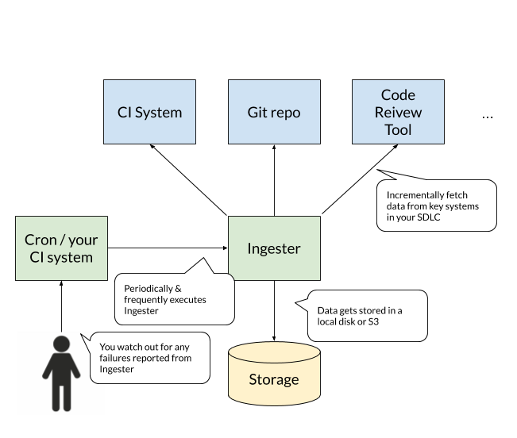

# Ingester
Ingester is a data extraction software used during
the Product Advisor Program (PAP) to retrieve data from tools in your software development lifecycle.
The data is used by Launchable to simulate the impact of Launchable in your team.

<!-- diagram source: https://docs.google.com/drawings/d/1s-UOJJoOVNNvbQtcJL3YaOqMLSgUNsRVM1x5OvDQolw/edit -->


Ingester is a short-lived command line program packaged as a Docker container.

What we'd like you to do is as follows:

1. Read this documentation to understand how the ingester works
1. Decide where to store data. We recommend you start with a local file system on top of a persisted storage. This directory will store data that often gets rotated and discarded in the tools, such as Jenkins build information, so we really do not want to lose anything in this directory! 
1. Find a mechanism to run ingester periodically, say every 3 hours. The simplest thing to do is to run from Cron. A CI system is also often a good mechanism.
1. Ensure that the ingester is running successfully.  


## Usage
Basic Usage is as follows:

```
docker run -u $(id -u) -ti --rm -e SECRET=$(cat ~/.launchable.secret) -v $PWD/data:/data \
  launchableinc/ingester:$VERSION \
  -d /data
  ...
``` 

* `-u $(id -u)` makes sure that the ingester uses your user ID on the host to run inside the container. This simplifies the file permissions. 
* `~/.launchable.secret` should contain a passphrase that you keep it to yourself and not share with Launchable. This is used to scramble identifiers.
* `-v $PWD/data:/data` mounts your host's `$PWD/data` into the container. This is the directory Ingester writes data files.
* `launchable/ingester:$VERSION` specifies the image and its version. We recommend you specify a fixed version, not `latest` to avoid unexpected disruptions. Your Launchable representative should tell you the exact version you should use. See [Docker Hub](https://hub.docker.com/repository/docker/launchableinc/ingester) for available versions.
* `-d /data` tells the ingester where to write data files, which is what you mounted from `$PWD/data`

For more details about the command line options and their meanings, run the ingester with `-help` 

### Direct upload to S3
Ingester is capable of uploading data directly to S3.
We recommend you to go this route once you get comfortable with the data
it is collecting. To do this, first place a credential file that we give you
in your local file system, such as `~/.launchable.s3.credentials`. The file
should look like this:

```
AWS_ACCESS_KEY_ID=xxxxxxxxxxxxxxx
AWS_SECRET_ACCESS_KEY=yyyyyyyyyyyyyyyyyyyyyyyyyy
AWS_REGION=us-west-2
```

Pass this file to `docker run` through the `--env-file` option:

```
docker run --env-file ~/.launchable.s3.credentials ...
```

Then modify the value of  the `-d` option to S3 URI:

```
-d s3://launchableinc-pap/YOURACCOUNT/
```

You can verify that everything is in order by running the `test:s3` command:
```
docker run --env-file ~/.launchable.s3.credentials -ti --rm \
  launchableinc/ingester:$VERSION test:s3 s3://launchableinc-pap/YOURACCOUNT/
```
